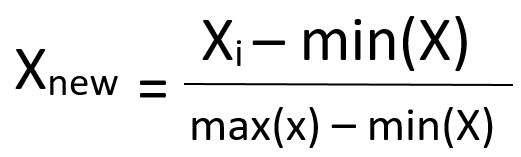
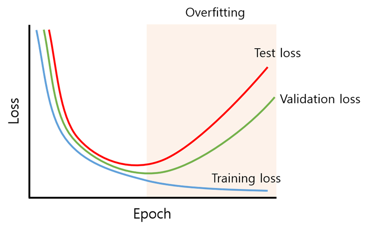

# Sub PJT1 & Sub PJT 2 전체 정리

> Sub PJT1과 Sub PJT2의 전체 주요 기술들을 정리해 보았습니다.

#### 전체 구성

- Image Captioning(IC): SubPJT1
- Text to Speech(TTS): SubPJT2

## Image Captioning

### 이미지 캡셔닝의 전체 학습 과정

- `데이터셋 준비 및 전처리 > 분류기 모델 설계 > Loss 함수 정의 > 모델 학습 > 특징 추출 > 캡션 결과 출력`

### 데이터셋 준비 및 전처리

`데이터셋 전처리`: 데이터 전처리는 기존의 데이터를 머신러닝 알고리즘에 알맞은 데이터로 바꾸는 과정

- 불 필요한 데이터 제거, 전체 속성 제거, 누락 데이터에 특정 값을 지정 등으로 데이터 가공(데이터 검수)

- 데이터셋(문자형, 이미지형 등)을 숫자형 데이터로 인코딩

- 이렇게 전환된 데이터는 다양한 범위의 숫자형 데이터이기 때문에 바로 ML 알고리즘이 학습을 잘 하지 못함.

- 이를 위해 `Min-Max Scaling(Normalization)` 과정을 거침.

  - **최솟값과 최댓값을 확인하여 이 값들을 모두 지정한 범위(대체로 0과 1 사이)의 상대적인 값으로 변환시키는 방법입니다.**

    **특정 범위를 지정하면 해당 범위 안으로 바인딩시키는 방법입니다.**

    

    

    출처: https://davinci-ai.tistory.com/15 [DAVINCI - AI]

  - 위 기능을 우리 프로젝트에서는 `torchvision`이 지원해줌.

### 분류기 모델 설계

`CNN(Convolutional neural network, 합성곱신경망)`:  정규화 된 버전의 다층 퍼셉트론이다. 다층 퍼셉트론은 일반적으로 완전히 연결된 네트워크, 즉 한 계층의 각 뉴런이 다음 계층의 모든 뉴런에 연결되는 신경망 구조

`전체 순서`: `데이터 탐색 > 모델 구성 > 모델 훈련 > 평가 > 예측하기`

**왜 CNN을 썼을까?**

- 일반 DNN(Deep Neural Network)의 문제점에서부터 출발합니다. 일반 DNN은 기본적으로 1차원 형태의 데이터를 사용합니다. 때문에 (예를들면 1028x1028같은 2차원 형태의)이미지가 입력값이 되는 경우, 이것을 flatten시켜서 한줄 데이터로 만들어야 하는데 이 과정에서 이미지의 공간적/지역적 정보(spatial/topological information)가 손실되게 됩니다. 또한 추상화과정 없이 바로 연산과정으로 넘어가 버리기 때문에 학습시간과 능률의 효율성이 저하됩니다.

  이러한 문제점에서부터 고안한 해결책이 CNN입니다. CNN은 이미지를 날것(raw input) 그대로 받음으로써 공간적/지역적 정보를 유지한 채 특성(feature)들의 계층을 빌드업합니다. CNN의 중요 포인트는 이미지 전체보다는 부분을 보는 것, 그리고 이미지의 한 픽셀과 주변 픽셀들의 연관성을 살리는 것입니다.

- 내가 정리해 본 간단한 예
  
  - 사람은 토끼의 귀만 보고도 토끼인지 아닌지를 식별 가능. 기존의 DNN은 이미지 형태의 데이터를 1차원 형태로 Flatten 작업을 해준 뒤 전체에 대한 연산과정을 시행하기 때문에 비효율적. 반면 CNN은 각 이미지 단위를 잘라서(`Kernel`, 커널) 한 커널과 주변 커널 간의 연관성을 살려 파악합니다. 때문에 토끼 귀만 보고도 토끼임을 파악할수 있는거죠..~
- 순서
  - `Kernal`의 크기와 가중치 설정
  - `Kernal`과 Input Image 데이터의 매트릭스 값을 맥트릭스 곱
    - 참고: 컬러 이미지 데이터인 경우 RGB까지 포함해 3D 데이터.
  - 본래 Input Image 데이터와 크기를 맞춰주기 위해 테두리에 `Padding`.
  - 설정한 `Stride`값 단위로 Input Image 단위로 움직이며 위 과정 반복.
    - Deep CNN을 원한다면? -> 이미지 결과 값(특이점 데이터)이 나옴. 개수가 너무 많기 때문에 각 결과값의 차원을 축소해주기 위해 `Pooling` 과정 시행.
  - 최종 이미지 결과 값(해당 이미지의 특이점 값) 출력.

> 이렇게 나온 최종 이미지 특이점 값(배열 형태)를 LSTM에 넣어줌
>
> * LSTM의 Input data 형태는 숫자형 배열 형태다.~

#### RNN과 LSTM(장단기 기억)

> 순환신경망(RNN)은 과거의 이벤트가 미래의 결과에 영향을 줄 수 있는 순환 구조(directed cycle)를 가지고 있다. 데이터 중에서도 연속적인 속성(sequence)을 띄고 있는 번역, 문자, 음성 인식 등 다양한 분야에서 RNN이 활용되고 있다. LSTM은 RNN의 주요 알고리즘으로 각광받고 있는 모델이다.

- RNN은 한마디로 직전 데이터(t-1)과 현재 데이터(t) 간의 상관관계(correlation)을 고려하여 다음의 데이터(t+1)를 예측. 다만 직전 정보만 참고하기 때문에 시간을 많이 거슬러 올라갈수록 예측력을 소실

- `LSTM`
- RNN의 주요 모델 중 하나로, 장기 의존성 문제를 해결할 수 있음
  
- 직전 데이터뿐만 아니라, 좀 더 거시적으로 과거 데이터를 고려하여 미래의 데이터를 예측하기 위함

#### LSTM 순서

- 과거 정보를 버릴지 말지 결정
  - 이전 Output과 현재 Input을 `시그모이드 함수`에 넣어 `cell state` 값이 0일 경우 결과에 영향을 못 미치므로 버리고, 1일 경우 안버림.

- 현재 정보를 저장할지 결정하는 과정
  - 현재의 `cell stat`값에 얼마나 더할지 말지를 정함.
- Update: 과거 cell state를 새로운 state로 업데이트
  - input gate * current state + forget * previous state
- 어떤 출력값을 출력할지 결정
  - 최종적으로 얻어진 cell state 값을 얼마나 빼낼지 결정하는 역할
  - output gate * updated state

## TTS

### 데이터셋 준비

- 우리 프로젝트에서는 LJ speech dataset을 사용합니다.
- LJ speech dataset은 단일 여성 화자의 131,000개의 짧은 영어 음성 클립으로, {(음성, 텍스트)}의 데이터 쌍을 가지고 있습니다.
  - 이것을 학습에 이용하기 위해서 용도에 따라서 train, validate, test데이터로 나누어줍니다.
- `Trainset`
  - 모델을 학습하기 위한 dataset
  - 학습할 때는 각기 다른 모델을 서로 다른 epoch(횟수)로 학습합니다.
- `Validate`
  - 학습이 이미 완료된 모델을 검증하기 위한 dataset입니다.
- `Test`
  - 학습과 검증이 완료된 모델의 성능을 평가하기위한 dataset입니다.

### Pre-Processing

> 앞에서 준비한 데이터 쌍(텍스트, 음성)을 모델이 처리 가능한 형태로 변환합니다.

- `임베딩 벡터화`
  - 텍스트를 문자 단위로 분리하고 이를 특징을 추출 및 수치화를 위한 캐릭터 임베딩 벡터화
  - 참고: 워드 임베딩(Word Embedding)은 단어를 벡터로 표현하는 방법으로, 단어를 밀집 표현으로 변환
- `음성 데이터에 대한 전처리`
  - 음성 데이터를 디지털 단위로 끊어서 저장해 놓는 것이 우리 프로젝트의 전처리.
  - 이렇게 전환된 음성 데이터는 음파 데이터로 1차원 데이터다.(시간의 흐름에 따라 음파 높이의 값을 가지는 1차원 데이터)
  - 이 음성 데이터를 CNN, RNN에 사용하기는 비적합하므로, `STFT(Short-time Fourier transform)`를 사용.
    - 전처리를 했다고 해도 이 음파의 모양이 진짜 뒤죽박죽, 해석불가.
  - `STFT(Short-time Fourier transform)`
    - 시간의 길이를 나눠서 퓨리에 변환을 하는 것.
      - `퓨리에 변환`
        - 아날로그 신호는 계속 연결형 데이터 -> 디지털 신호처럼 Descript 형태의 데이터로 변환
        - 뒤죽박죽한 신호를 이쁜 신호로 만듬. (해석할 수 있는 함수형으로 전환)
    - 주파수의 특성이 시간에 따라 달라지는 사운드를 분석한다.
    - 우리 프로젝트에서는 구체적으로 `TacotronSTFT()` 클래스를 사용.

### Training

> 이렇게 이쁜 함수모양으로 정리한 데이터셋을 Tacotron2에 학습시킨다.

- 모델은 크게 인코더, 디코더, 보코더 3개의 파트로 나뉨.
- Text -> (인코더) -> (디코더) -> `mel-spectrongram` -> (보코더) -> 재생 가능한 음성파일로 전환
  - Text를 CNN과 LSTM에 넣어서 특정 벡터로 추출(인코더)
  - 다시 이 특정 벡터는 음성파일로 바로 바꿀 수 없기 때문에 디코딩을 해서 `mel-spectrongram(멜 스패크트롬, 데이터를 수치적으로 조절 용이하게 만든 폼)`으로 바꿈
  - 이 멜 스페크트롬을 보코더가 재생 가능한 파일(waveform)
- 저희 프로젝트는 모델의 인코더와 디코더 부분만 학습시키고, 보코더는 미리 학습된 모델을 사용합니다.
- 우리가 사용하는 `tacotron2` 모델은 wavenet이라는 보코더를 사용하지만 변환 성능이 그리 좋지 않아, waveglow라는 보코더로 대체하여 사용합니다.

**여기서 잠깐! Tactron2란??** 

- `Tacotron2`: 구글이 발표한 인공지능 모델 몬스터..!
  - Tacotron2란 Text-To-Speech model로서 문자열을 입력으로 받아서 음성을 합성하는 기술입니다.
  - 최근에 주목받는 연구는 딥러닝 기반 end-to-end 음성 합성 방식으로, 문자열 입력과 파형 출력간의 관계를 직접적으로 모델을 통해 학습시키는 방식입니다.
  - `end-to-end`: 입력부터 출력까지 하나의 모듈로 이루어져 있어, 전문적인 지식을 덜 요구하고 사용하기가 편함. 
  - 때문에 `Tacotron2`는 인공지식에 대한 지식이 깊지 않아도 비교적 사용하기 쉬워 각광받고 있다. + 음질도 좋음.

### Validating 

- 기본적으로 머신러닝 모델은 training loss가 작아지도록 학습을 진행하기 때문에 학습이 계속 될수록 점점 training dataset에 fitting됩니다. 

- 이러한 학습 결과는 신뢰도가 떨어질 수 있습니다.

- 따라서 학습을 진행하는 중에 일정주기마다 validate 데이터셋으로 본 모델을 평가할 수 있습니다.

  평가를 마친 후에 loss값 등의 학습 중간 정보들을 로그로 기록하고, 학습된 모델의 파라미터 정보도 저장할 수 있습니다.

  

  위 그래프는 validation loss를 이용하여 overfitting을 방지하는 방법을 보여줍니다. Validation loss가 증가하는 시점부터 overfitting이 발생했다고 판단하여 학습을 중단합니다.

### Testing

- 학습이 완료된 후에는 가장 좋은 성능을 보인 모델을 선정하고 사전 학습된 waveglow모델을 연결하여 TTS시스템을 완성합니다!

